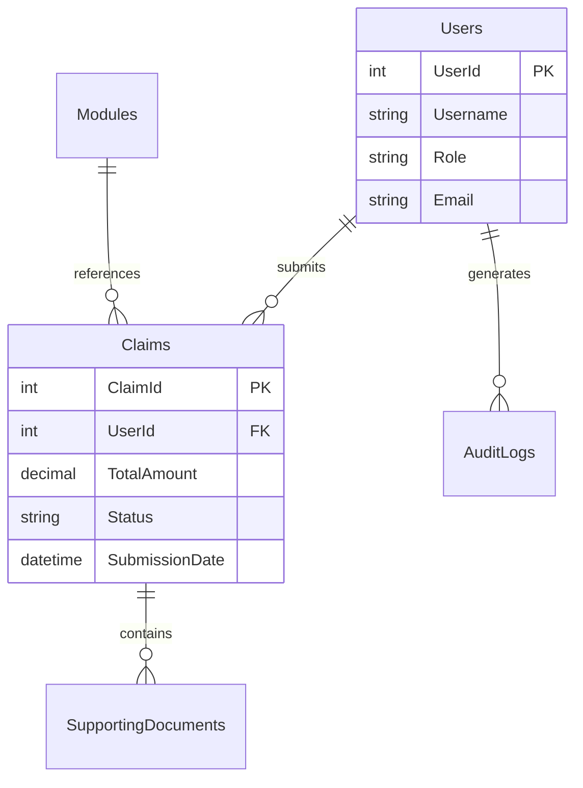

# 📊 Contract Monthly Claim System (CMCS)

<div align="center">


**A powerful web application for managing contract lecturer claims with enterprise-grade features**

[Features](#-features) • [Installation](#-installation--setup) • [Usage](#-usage-guide) • [Documentation](#-project-structure)

</div>

---

## 🌟 About The Project

The **Contract Monthly Claim System** is a comprehensive ASP.NET Core web application designed to revolutionize how educational institutions manage monthly claims for contract lecturers. Built with modern web technologies and best practices, CMCS streamlines the entire claim lifecycle from submission to approval and reporting.

### ✨ Why CMCS?

- 🚀 **Efficient Workflow** - Automated calculations and real-time status updates
- 🔒 **Enterprise Security** - Role-based access control with complete audit trails
- 📈 **Powerful Analytics** - Visual dashboards and comprehensive reporting
- 💼 **Professional Grade** - Built with ASP.NET Core and Entity Framework
- 🎯 **User-Friendly** - Intuitive interface powered by Bootstrap 5

---

## 🎯 Features

### 🔐 Authentication & Authorization
<table>
<tr>
<td width="50%">

**Multi-Role System**
- 👨‍🏫 Lecturers - Submit and track claims
- 👔 Coordinators - Review and approve
- 🎓 Managers - Full system oversight

</td>
<td width="50%">

**Security First**
- Secure session management
- Role-based permissions
- Input validation & sanitization

</td>
</tr>
</table>

### 📝 Claims Management

```
✅ Smart Submission      → Automatic total calculations
📎 Document Support      → PDF, DOCX, XLSX, images
🔄 Real-Time Tracking    → Live status updates
✏️ Full CRUD Operations  → Edit and delete pending claims
```

### 📊 Reporting & Analytics

- **📈 Visual Dashboards** - Interactive charts powered by Chart.js
- **📅 Date Range Filters** - Flexible time-based reporting
- **💾 Multiple Exports** - CSV and PDF download options
- **💰 Financial Summaries** - Automated calculations and insights

### 🔍 Audit & Compliance

- 📝 Complete audit trail of all system activities
- 🌐 IP address tracking for security monitoring
- 🔐 Role-based data access controls
- 📊 Comprehensive activity logs

---

## 🛠️ Technology Stack

<table>
<tr>
<td align="center" width="33%">

### Backend


**ASP.NET Core 6.0**
Entity Framework Core
SQL Server

</td>
<td align="center" width="33%">

### Frontend


**HTML5 & CSS3**
Bootstrap 5.3
JavaScript/jQuery
Chart.js

</td>
<td align="center" width="33%">

### Tools & Libraries


**Visual Studio 2022**
SQL Server LocalDB
.NET CLI

</td>
</tr>
</table>

---

## 🗄️ Database Architecture



### Core Entities

| Entity | Description | Key Fields |
|--------|-------------|------------|
| 👥 **Users** | System users with role assignments | UserId, Username, Role, Email |
| 📚 **Modules** | Course modules with hourly rates | ModuleId, ModuleName, HourlyRate |
| 📋 **Claims** | Monthly claim submissions | ClaimId, TotalAmount, Status |
| 📎 **SupportingDocuments** | File attachments | DocumentId, FileName, FilePath |
| 📊 **AuditLogs** | System activity tracking | LogId, Action, Timestamp, IPAddress |

---

## 🚀 Installation & Setup

### Prerequisites

Before you begin, ensure you have the following installed:

- ✅ [.NET 6.0 SDK](https://dotnet.microsoft.com/download/dotnet/6.0)
- ✅ [SQL Server](https://www.microsoft.com/sql-server/sql-server-downloads) (LocalDB or Express)
- ✅ [Visual Studio 2022](https://visualstudio.microsoft.com/) or [VS Code](https://code.visualstudio.com/)

### Quick Start

1️⃣ **Clone the repository**
```bash
git clone https://github.com/yourusername/cmcs.git
cd cmcs
```

2️⃣ **Configure database connection**
```json
// appsettings.json
{
  "ConnectionStrings": {
    "DefaultConnection": "Server=(localdb)\\mssqllocaldb;Database=CMCS;Trusted_Connection=true;"
  }
}
```

3️⃣ **Run database migrations**
```bash
dotnet ef database update
```

4️⃣ **Launch the application**
```bash
dotnet run
```

5️⃣ **Access the application**
```
Navigate to: https://localhost:5001
```

---

## 👥 Default User Accounts

| Role | 👤 Username | 🔑 Password | 🎯 Access Level |
|------|-------------|-------------|-----------------|
| 👨‍🏫 **Lecturer** | `lecturer1` | `password123` | Submit and view own claims |
| 👔 **Coordinator** | `coordinator1` | `password123` | Review and approve claims |
| 🎓 **Manager** | `manager1` | `password123` | Full system access + reports |

> ⚠️ **Security Note**: Change default passwords immediately in production!

---

## 💡 Usage Guide

### For Lecturers 👨‍🏫

```
1. 🔐 Login with lecturer credentials
2. ➕ Click "Submit New Claim"
3. 📝 Enter module details and hours worked
4. 📎 Upload supporting documents
5. ✅ Submit and track status in dashboard
```

### For Coordinators 👔

```
1. 🔐 Login with coordinator credentials
2. 📋 View pending claims in dashboard
3. 🔍 Review claim details and documents
4. ✅ Approve, ❌ Reject, or 🔄 Request Revisions
5. 💬 Add notes and feedback
```

### For Managers 🎓

```
1. 🔐 Login with manager credentials
2. 📊 Access comprehensive dashboard
3. 📈 Generate custom reports with filters
4. 🔍 View audit logs for monitoring
5. 💾 Export data in CSV/PDF formats
```

---

## 📊 Key Functionalities

<table>
<tr>
<td width="50%">

### 🔢 Smart Features
- ⚡ Automated calculations (Hours × Rate)
- 📁 Secure file management
- 🔄 Real-time status updates
- 🔍 Advanced filtering options
- 📧 Comprehensive notifications

</td>
<td width="50%">

### 📈 Analytics
- 📊 Visual dashboards
- 💰 Financial summaries
- 📅 Trend analysis
- 📋 Performance metrics
- 💾 Multiple export formats

</td>
</tr>
</table>

---

## 🔒 Security Features

- 🛡️ Role-based access control (RBAC)
- 🔐 Secure session management
- ✅ Input validation and sanitization
- 📝 Complete audit trail logging
- 📎 File type and size validation
- 🌐 IP address tracking
- 🔒 SQL injection prevention

---

## 📁 Project Structure

```
CMCS/
├── 📂 Controllers/
│   ├── AccountController.cs      # 🔐 Authentication & authorization
│   ├── ClaimsController.cs       # 📋 Claims CRUD operations
│   ├── DashboardController.cs    # 📊 Analytics & statistics
│   └── ReportsController.cs      # 📈 Reporting & exports
│
├── 📂 Models/
│   ├── User.cs                   # 👤 User entity
│   ├── Claim.cs                  # 📋 Claim entity
│   ├── Module.cs                 # 📚 Module entity
│   ├── SupportingDocument.cs    # 📎 Document entity
│   ├── AuditLog.cs              # 📊 Audit entity
│   └── ViewModels/              # 🔄 Data transfer objects
│
├── 📂 Views/
│   ├── Account/                 # 🔐 Login & registration
│   ├── Claims/                  # 📋 Claim management
│   ├── Dashboard/               # 📊 Analytics dashboard
│   └── Reports/                 # 📈 Reporting interface
│
├── 📂 Data/
│   └── ApplicationDbContext.cs  # 🗄️ EF Core context
│
└── 📂 wwwroot/
    ├── css/                     # 🎨 Stylesheets
    ├── js/                      # ⚡ JavaScript files
    └── uploads/                 # 📎 Document storage
```

---

## 🐛 Troubleshooting

### Common Issues & Solutions

| ❌ Issue | ✅ Solution |
|---------|----------|
| Database connection error | Verify SQL Server is running and connection string is correct |
| File upload fails | Ensure `wwwroot/uploads/documents/` directory exists with write permissions |
| Session timeout | Default is 30 minutes - extend in `Startup.cs` if needed |
| "Access Denied" error | User may lack required role permissions |
| Login fails | Verify username and password; check `Users` table |
| File size error | Uploads limited to 10MB - adjust in configuration |

### Debug Mode

Enable detailed logging in `appsettings.Development.json`:
```json
{
  "Logging": {
    "LogLevel": {
      "Default": "Debug",
      "Microsoft": "Information"
    }
  }
}
```

---

## 🔮 Roadmap & Future Enhancements

- [ ] 📧 Email notification system
- [ ] 🔄 Bulk claim processing
- [ ] 📊 Advanced analytics with ML insights
- [ ] 📱 Mobile-responsive improvements
- [ ] 🌍 Multi-language support
- [ ] 🔔 Push notifications
- [ ] 📤 API integration capabilities
- [ ] 🎨 Theme customization
- [ ] 📋 Workflow automation
- [ ] ☁️ Cloud deployment templates

---

## 📄 License

This project is licensed under the MIT License - see the [LICENSE](LICENSE) file for details.

---

## 👨‍💻 Author & Contact

**Your Name**
- 🌐 GitHub: [@yourusername](https://github.com/yourusername)
- 📧 Email: Thatomsina@gmail.com
- 💼 LinkedIn: [My Profile](https://linkedin.com/in/thato-msina)


---

## 🙏 Acknowledgments

- Built with ❤️ using ASP.NET Core 6.0
- UI powered by Bootstrap 5.3
- Charts by Chart.js
- Icons from Font Awesome

---

<div align="center">

### ⭐ Star this repository if you find it helpful!

**Version 1.0** • Last Updated: December 2024

Made with 💙 by developers, for developers

</div>
